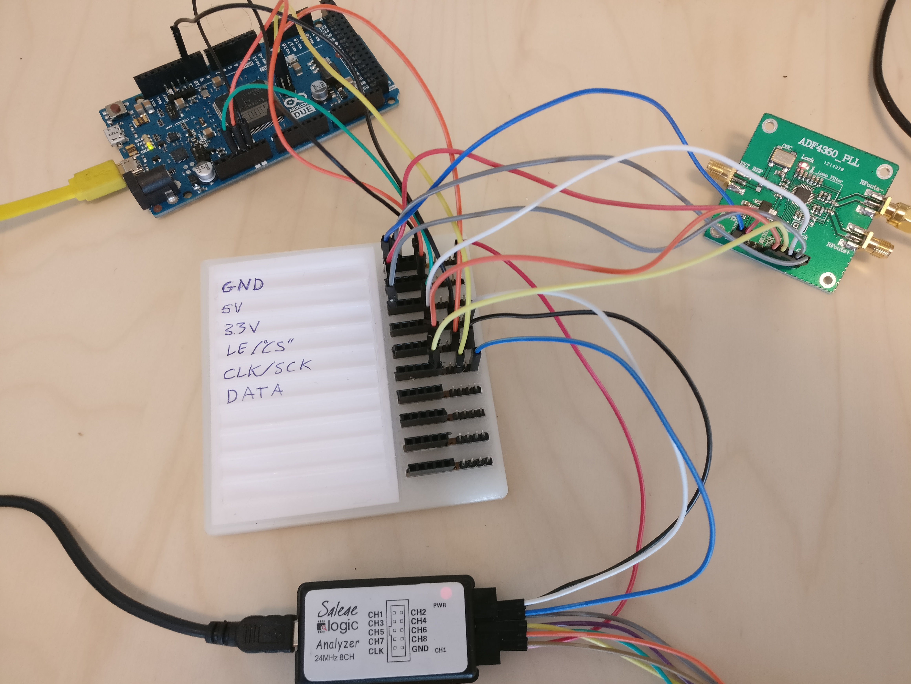

# What is the ProtoSwitchBoard?

Does all your electronics prototypes end up looking like a snake nest? Are you forced to trace each cable to reverse engineer your own prototypes after getting back from a coffee break? The ProtoSwicthBoard is a labeled interconnect for your project designed to make your experimental prototypes as easy to follow as your circuit diagram!

It is especially suited for projects utilizing some kind of bus (i2c, spi etc) where multiple units share connections. Below is a picture of an experimental setup with an ADF signal generator hooked up to an arduino over spi, and a logic analyzer to debug the protocol. It is using an early prototype of the ProtoSwitchBoard:

# Where can I get one
FIXME: Add link to kickstarter here

# How can I make one?
Head over to https://github.com/innovationgarage/ProtoSwitchBoard and download the design sketches and production guides. Making your own requires a 3d printer and intermediate soldering skills.

# License
All designs are Creative Commons CC-BY-SA licensed, so hack away at our design and make it better! Just remember that if you publish any derivative designs they need to use the same license! Sharing is caring!
